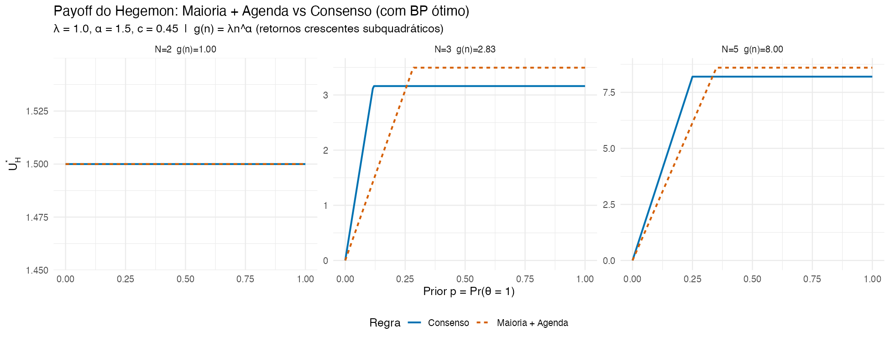
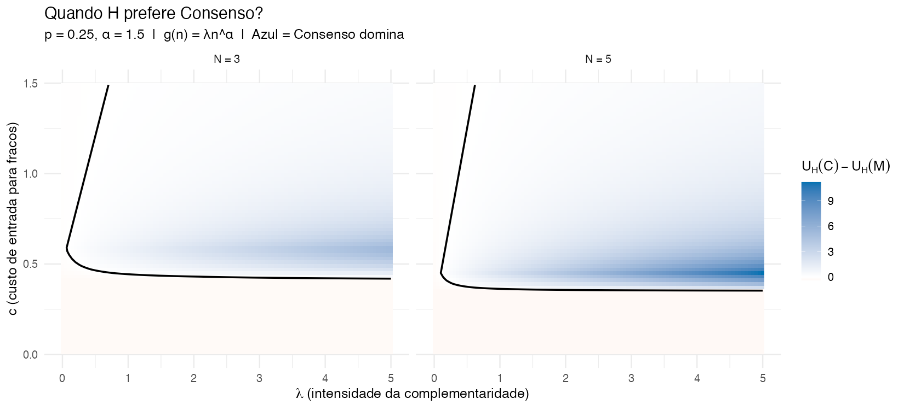
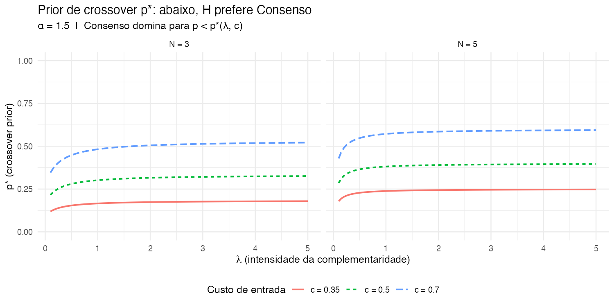
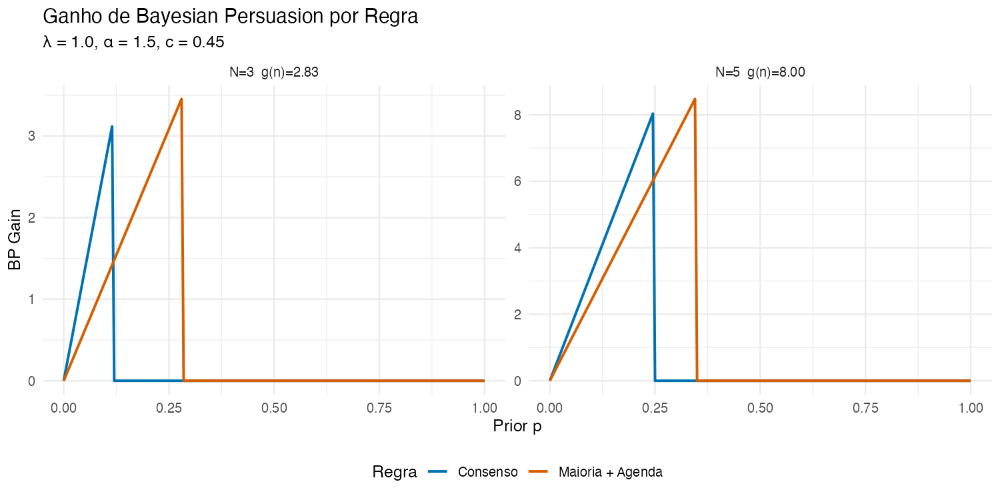
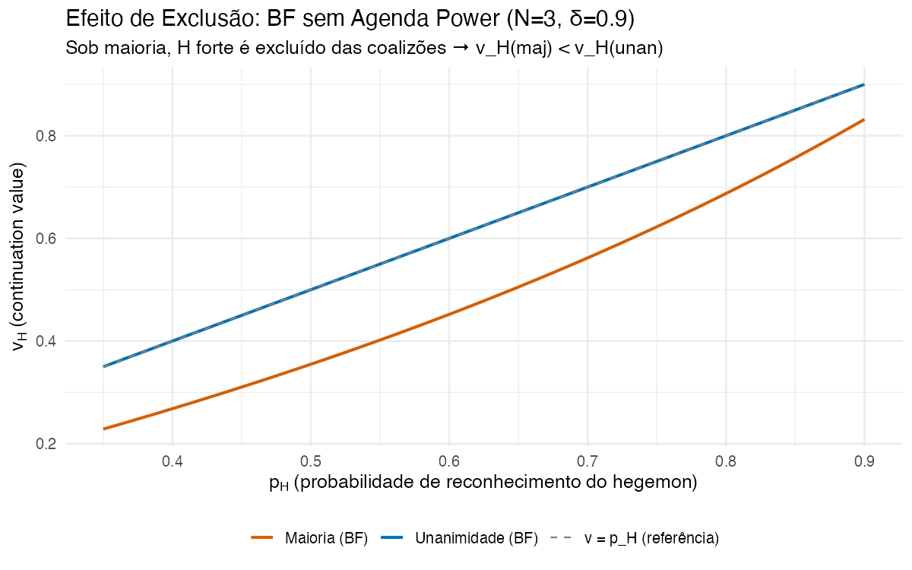

```{r setup, include=FALSE}
knitr::opts_chunk$set(echo = FALSE, message = FALSE, warning = FALSE)
```

# The Puzzle

Here is something that should bother you about international institutions.

In the World Trade Organization, the United States --- the most powerful country in the system --- operates under *consensus*. Every member, no matter how small, can effectively block a decision. The US has no formal veto that others lack, no weighted vote, no privileged agenda-setting role that would let it push through outcomes over objections.

Why would a hegemon agree to this?

The standard logic in political economy says it shouldn't. In legislative bargaining models like @baron1989bargaining, a player with agenda power --- the ability to propose how to divide a pie --- benefits enormously from *majority* rule. The proposer can assemble a minimum winning coalition, exclude the rest, and capture most of the surplus. @kalandrakis2006proposal formalizes this further: the power to propose is the fundamental source of political power. Under majority rule, agenda power translates directly into distributive advantage.

So the naive prediction is clear: if the US has disproportionate power (formal or informal), it should prefer institutions where it can leverage that power through majority voting. Consensus --- where everyone has a veto --- should be the last thing a hegemon wants.

And yet: the GATT/WTO has operated by consensus since its founding. The US was instrumental in designing it that way. Similar consensus norms prevail at WIPO, in parts of the UN system, and in other multilateral economic institutions [@steinberg2002shadow; @koremenos2001rational].

# Two Types of Power

The resolution I propose starts from a distinction between two types of power that a hegemon can wield in international institutions:

**Agenda power** is the ability to propose allocations and form coalitions. Under majority rule, a player with agenda power can exclude others from the winning coalition and extract surplus --- this is the classic Baron-Ferejohn mechanism.

**Informational power** is the ability to shape what others believe. A hegemon like the US often has superior analytical capacity, intelligence infrastructure, and expertise about the quality of proposed agreements. This is the domain of *Bayesian Persuasion* [@kamenica2011bayesian]: the informed player designs an information structure --- choosing what to reveal and what to withhold --- to influence the decisions of others.

The key insight is that **these two types of power interact with institutional rules in opposite ways**:

| | Majority Rule | Consensus |
|---|---|---|
| **Agenda power** | Active: proposer extracts via coalitions | Neutralized: everyone has a veto |
| **Informational power** | Less effective: others discount signals | More effective: credibility is higher |

Under majority, agenda power gives the hegemon direct distributive gains. But the same feature that makes majority attractive for extraction --- the ability to exploit coalition partners in future bargaining --- also makes weaker states *skeptical* of the hegemon's informational signals. Why trust the hegemon's claim that "this agreement is good for everyone" when you know it can exploit you once you're inside?

Under consensus, the hegemon cannot exploit others through agenda power (every member has a veto on future decisions). But precisely because of this protection, weaker states are more willing to trust the hegemon's signals. The threshold for persuasion drops. Informational power becomes more effective.

# Institutional Packages

A crucial observation: the choice between majority and consensus is not just about voting rules. It is about **institutional packages** that bundle a voting rule with an agenda-setting arrangement. Consider all four combinations:

| Package | Rule | Agenda | $V_H$ | $V_W$ | Viable? |
|---|---|---|---|---|---|
| A | Majority | H controls | High | Low | Yes --- H extracts via coalitions |
| B | Consensus | H controls | ~1 | ~0 | **No** --- destroys adhesion |
| C | Consensus | No agenda control (random) | 1/N | 1/N | Yes --- veto + rotation protects W |
| D | Majority | No agenda control | ~1/N | ~1/N | Possible, but H doesn't want it (exclusion effect) |

**Package B is not an equilibrium.** Under unanimity with the hegemon as exclusive proposer in a single-round game, each weak state's outside option from rejection is 0, so the hegemon offers 0 to each W. This yields $V_W(B) = 0$, making the entry threshold $\tau(B) = c$ --- strictly higher than $\tau(C) = c - 1/N$. The persuasion return $A(B)/\tau(B)$ is lower than $A(C)/\tau(C)$: Package C dominates B.

**Package D** is unattractive for the hegemon: under majority without agenda power, the hegemon is *excluded* from others' coalitions (the BF exclusion effect documented in the next section).

So the real comparison is **Package A vs Package C**: {majority + agenda control} vs {consensus + no agenda control}.

This matches reality. The WTO operates by consensus *and* is member-driven: rotating presidency, no permanent proposer. This is not merely a norm --- it is an equilibrium configuration. Under consensus, the hegemon voluntarily gives up agenda control because keeping it would destroy the willingness of weak states to participate.

The fundamental trade-off becomes: **extraction via agenda power (Stage 2) vs extraction via informational power (Stage 1)**.

# The Model in a Nutshell

The model has three stages, solved by backward induction:

**Stage 0 (Institutional Design):** The hegemon chooses between two viable institutional packages: **Package A** (majority + agenda control, where H is the exclusive proposer) or **Package C** (consensus + no agenda control, where proposal rights rotate and everyone has a veto).

**Stage 1 (Bayesian Persuasion + Entry):** The pie has size $V$. The hegemon observes $V$ and proposes terms $x_i$ to each weak state. Weak states observe their $x_i$ but *not* the hegemon's take ($y = V - n \times x_i$). Nature draws $\theta \in \{0, 1\}$: $\theta = 1$ means the deal is genuinely fair (high $V$, proportional sharing); $\theta = 0$ means it is extractive (low $V$, or the hegemon takes almost everything). The prior $p = \Pr(\theta = 1)$ captures how skeptical weak states are about the deal terms --- low $p$ means they expect exploitation. The hegemon designs an information structure (a public signal) to shape beliefs about $\theta$. Each weak state decides whether to join. The agreement enters into force if the relevant threshold is met.

**Stage 2 (Redistribution):** Once inside the institution, members face a single-round redistribution game. The hegemon proposes a division of a pie; the proposal passes by the institutional rule (majority or consensus). This stage captures future distributive bargaining within the institution.

The critical feature: **Stage 2 is solved first, and the results feed back into Stage 1.** Weak states anticipate how they will fare *inside* the institution and use that to decide whether to enter.

## What happens in Stage 2

Under **majority + agenda power**, the hegemon proposes a division, includes just enough allies to form a winning coalition (offering each their status quo share of $1/N$), and keeps the rest. Some weak states are excluded and get nothing. The hegemon's expected payoff exceeds $1/N$.

Under **consensus**, every member has a veto. The hegemon cannot improve on the equal split: $V_H = V_W = 1/N$.

These are *results* of the game, not assumptions. They deliver:

- $V_H(M) > V_H(C)$: the hegemon extracts more under majority
- $V_W(M) < V_W(C)$: weak states get less under majority

## What happens in Stage 1

The entry threshold for weak states is $\tau(R) = c - V_W(R)$, where $c$ is the cost of joining. Since $V_W(M) < V_W(C)$:

$$\tau(M) > \tau(C)$$

**Entry is harder under majority.** Weak states demand more convincing because they anticipate future exploitation --- their skepticism about the deal terms is higher.

The hegemon uses Bayesian Persuasion to manipulate beliefs about $V$, which lets it offer lower $x_i$ and still get acceptance --- in effect, *buying consent cheaper*. With a step-function value (either the agreement forms or it doesn't), the optimal BP gives the hegemon:

$$U_H^*(R) = \frac{g + V_H(R)}{\tau(R)} \times p \quad \text{when } p < \tau(R)$$

where $g > 0$ is a scalar representing the complementarity value of broad membership, and $p$ is the prior probability that the agreement is good. (One can microfound $g$ as $g(k) = \lambda k^\alpha$ --- convex, subquadratic --- but the qualitative results hold for any $g > 0$.)

## The Trade-off

The hegemon faces a fundamental choice:

- **Majority + agenda**: higher $V_H$ (more extraction in Stage 2), but higher $\tau$ (harder to persuade)
- **Consensus**: lower $V_H$ (no extraction via agenda), but lower $\tau$ (easier to persuade)

**Consensus dominates when the persuasion advantage outweighs the extraction disadvantage** --- specifically, when the complementarity value $g$ is large and the prior is pessimistic ($p$ low), meaning weak states are skeptical about the deal terms and need to be persuaded that the hegemon is not extracting everything. Under consensus, the threshold is lower because weak states are protected in Stage 2 (everyone has a veto), so they accept more risk that $\theta = 0$.

# Results from the Simulation

The model is solved analytically and simulated for $N = 2, 3, 5$ players. The simulation uses the parameterization $g = \lambda k^\alpha$ with $\alpha = 1.5$ (convex, subquadratic) as a specific functional form for the complementarity value. The qualitative results hold for any $g > 0$.

## Payoff comparison across N



Three panels tell the story:

- **N = 2** is degenerate: with only two players, majority equals unanimity. No trade-off exists.
- **N = 3**: For low priors ($p < 0.26$), the blue line (consensus) is above the orange (majority). The hegemon prefers consensus when the prior is pessimistic --- i.e., when weak states are skeptical about the deal terms and suspect the hegemon is extracting maximum value, so persuasion is needed.
- **N = 5**: The pattern is similar but the gap widens. With more members, the complementarity value $g$ is larger (under any convex parameterization), strengthening the case for consensus.

## When does the hegemon prefer consensus?



The heatmap shows the advantage of consensus (blue) versus majority (red) in the $(\lambda, c)$ parameter space (where $g = \lambda k^\alpha$ in the simulation), for a fixed prior $p = 0.25$.

For N = 5, the blue region is much larger: with more members and stronger complementarities, consensus dominates over a wide range of parameters.

## The crossover prior



The crossover prior $p^*$ is the threshold below which the hegemon prefers consensus. It increases with $g$ (the institution's complementarity value) and with $c$ (the entry cost for weak states). Higher $c$ means persuasion matters more, giving consensus a bigger edge.

## The value of Bayesian Persuasion



Without BP, the institution cannot form when $p < \tau(R)$: weak states simply won't enter --- their skepticism about the deal terms is too high. With BP, the hegemon can manipulate beliefs about $V$ and buy consent cheaper, creating the institution even when the prior is unfavorable. The gain is larger under consensus (lower threshold, so BP activates for a wider range of priors).

**BP is essential to the mechanism.** Without it, the trade-off between rules disappears: if the agreement always forms (high $p$, weak states trust the deal terms), majority always dominates. It is the *interaction* of informational power with institutional rules that generates the preference for consensus.

# Why Majority Requires Agenda Power

A subtlety that is worth noting. In the standard Baron-Ferejohn model with random recognition (where each player proposes with some probability), a player with *high* recognition probability is actually **excluded** from others' coalitions under majority rule. The reason: high recognition makes the player's continuation value expensive, so others prefer to buy cheaper partners.



For $N = 3$ with $\delta = 0.9$, a player with recognition probability 0.6 gets a *lower* expected payoff under majority than under unanimity in the BF model. This is not a paradox --- it is a well-known feature of BF coalition dynamics [@eraslan2019legislative].

The implication is that majority rule is only attractive for the hegemon **if it comes bundled with explicit agenda power** (exclusive proposer rights). Without it, the hegemon would trivially prefer unanimity. This justifies why our model gives the hegemon proposer status under majority: that is the package that makes majority a genuine alternative to consensus.

# The WTO Trajectory: An Informational Erosion Story

The model generates a prediction about *dynamics* through comparative statics on $p$:

| Period | Skepticism ($p$) | BP useful? | Hegemon prefers... | Outcome |
|---|---|---|---|---|
| Pre-2000 | Low $p$ (weak states can't assess extractiveness) | Yes | Consensus | WTO works |
| Post-2000 | High $p$ (weak states evaluate deal terms independently) | No | Majority | Doha stalls |

As weak states learned --- through the Washington Consensus, trade liberalization, and capacity building --- they developed the ability to assess deal terms on their own. When everyone can evaluate whether $V$ is being shared fairly or whether the hegemon is taking almost everything, the scope for manipulating beliefs about $V$ shrinks. Under consensus, without informational power, the hegemon gets only $1/N$ --- the same as everyone else.

But the institutional rule was already fixed: the WTO operates by consensus. The hegemon cannot switch to majority. The result: **the US disengages, blocks negotiations, and Doha stalls.**

Meanwhile, the US shifts toward bilateral and regional agreements --- forums where it *does* have agenda power. The proliferation of FTAs since the 2000s is consistent with a hegemon whose informational power has declined and who now needs to rely on agenda power instead.

# What "Hegemon" Means

In this model, a hegemon is a player with two dimensions of power:

1. **Informational power** (sender in Bayesian Persuasion): observes the state and designs information
2. **Agenda power** (proposer in redistribution): proposes allocations and forms coalitions

These dimensions are not freely combinable --- they come in **institutional packages**. Under Package A (majority + agenda), both are active. Under Package C (consensus + no agenda), only informational power remains. The hegemon *voluntarily* gives up agenda control under consensus because keeping it would destroy adhesion (Package B is not viable).

The paper's contribution is showing that **informational power alone can be more valuable than both types combined** --- when the complementarity value $g$ is large and the prior is pessimistic ($p$ low), meaning weak states are skeptical about the deal terms, suspecting the hegemon of extracting as much as possible.

This offers a new lens on institutional design: consensus is not a concession by the powerful. It is an *investment* in the credibility of persuasion --- and it comes as part of an equilibrium package where the hegemon trades agenda power for informational effectiveness.

# References
